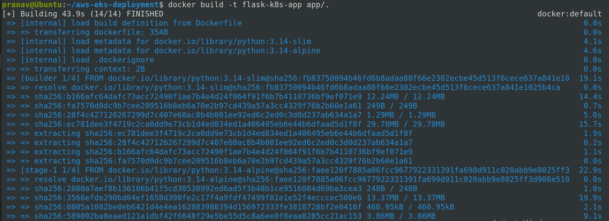

# AWS-EKS-Deployment

#### Architecture Diagram:


***

#### Tech Stack Used:

* AWS (EKS, VPC, ECR, EC2, IAM, ALB)
* Kubernetes
* Docker
* Terraform
* Flask (python)

***

#### Features:

* Containerized Flask application using docker multi-stage build
* Store Image in AWS ECR&#x20;
* Deployed on AWS EKS&#x20;
* Infrastructure provisioned via Terraform
* Exposed via ALB Ingress

***

#### Steps to build:

<details>

<summary>Clone GitHub repository</summary>

```bash
git clone https://github.com/pranavsoni21/aws-eks-deployment.git
cd /aws-eks-deployment
```

</details>

<details>

<summary>Build Docker Image</summary>

```bash
docker build -t flask-k8s-app app/.
```

<figure><figcaption></figcaption></figure>

After this, you will end up with a docker image (flask-k8s-app:latest) built locally:

<figure><figcaption></figcaption></figure>

As I built multi-staged Dockerfile, you can see the image is very less - around 40 MB.

</details>

<details>

<summary><strong>Push Image to Docker Registry ( I used AWS ECR )</strong></summary>

To perform this step, first you have to create a ECR repository on AWS:

Before creating AWS ECR repository via cli, make sure you already configured aws-cli with valid credentials and with needed IAM permission.

```bash
aws ecr create-repository --repository-name flask-k8s-app --image-scanning-configuration scanOnPush=true --region ap-south-1
```

After repository creation, output will print out your repository URI like these, copy it somewhere as we will use it very often:

```
"repositoryUri": "<account-id>.dkr.ecr.ap-south-1.amazonaws.com/flask-k8s-app"
```

Now, tag your image for pushing it to ECR:

```bash
docker tag \
flask-k8s-app:latest \
816709079541.dkr.ecr.ap-south-1.amazonaws.com/flask-k8s-app:latest
```

Get temporary login-password from AWS ECR to let docker push this image to our repo:

```bash
aws ecr get-login-password --region ap-south-1 | \
docker login \
--username AWS \
--password-stdin \
816709079541.dkr.ecr.ap-south-1.amazonaws.com/flask-k8s-app
```

Now, we are all set to push our docker image to AWS ECR:

```bash
docker push 816709079541.dkr.ecr.ap-south-1.amazonaws.com/flask-k8s-app:latest
```

<figure><figcaption></figcaption></figure>

For confirmation, we can also check this out on AWS console:

<figure><figcaption></figcaption></figure>

</details>

<details>

<summary>Provision AWS Infrastructure via terraform</summary>

To provision whole infrastructure using terraform on AWS, you have to first configure your aws-cli with your AWS account who have permission to perform all this action.

Once you configured aws-cli, terraform will automatically use that configuration to provision infrastructure on-behalf of your AWS user.

```
cd terraform/
terraform init
terraform apply
```

<figure><figcaption></figcaption></figure>

<figure><figcaption></figcaption></figure>

Make sure it will create all these 22 resources on AWS. It will take up to 10 minutes to create all these resources. Once it's done, we can move on to our next step.

</details>

<details>

<summary>Deploy app using kubernetes</summary>

Before moving ahead, make sure you have kubernetes and kubectl installed on your machine.


</details>


