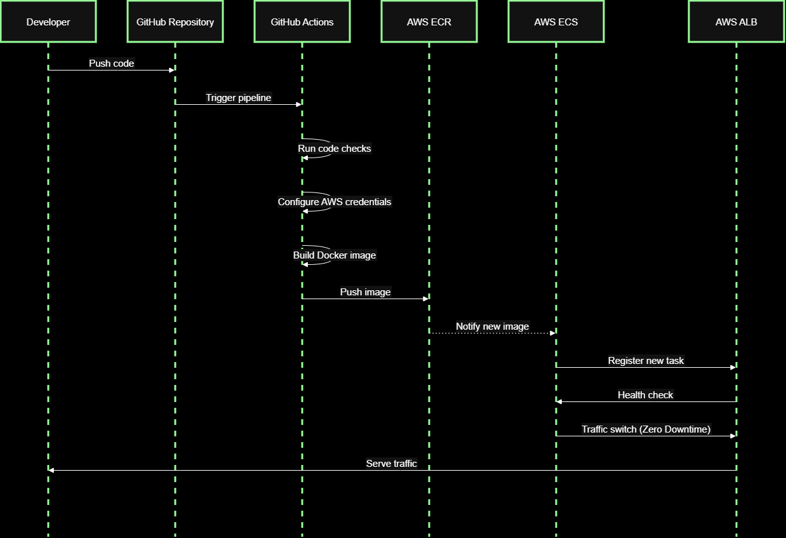

# Production Ready Pipeline

Github Repository URL: [https://github.com/pranavsoni21/Production-Ready-Pipeline](https://github.com/pranavsoni21/Production-Ready-Pipeline)

Readme on portfolio website:&#x20;

***

#### Architecture Diagram

<figure><figcaption></figcaption></figure>

***

#### Request Flow

```
Developer pushes code
↓
GitHub Actions pipeline triggers
↓
Docker Buildx builds multi-architecture image
↓
Image pushed to AWS ECR
↓
ECS service pulls new image
↓
Application Load Balancer distributes traffic
```

***

#### Tech Stack Used

* Application ( flask, python, gunicorn )
* containerization ( docker )
* CI/CD ( Github actions )
* Cloud Infrastructure ( AWS VPC, ECR, ECS, ALB )

***

#### Steps to build



### Create a basic flask application

You can use this one:

```python
from flask import Flask, jsonify, request

app = Flask(__name__)

users = []


@app.route("/")
def home():
    return jsonify({
        "message": "DevOps Portfolio API",
        "status": "running"
    })


@app.route("/health")
def health():
    return jsonify({
        "status": "healthy"
    })


@app.route("/users", methods=["GET"])
def get_users():
    return jsonify(users)


@app.route("/users", methods=["POST"])
def create_user():
    data = request.json

    user = {
        "id": len(users) + 1,
        "name": data.get("name"),
        "email": data.get("email")
    }

    users.append(user)

    return jsonify(user), 201


if __name__ == "__main__":
    app.run(host="0.0.0.0", port=5000)
```

It's just a basic flask application with 3 routes \["/", "/users", "/health"]. I included /health route as we will use it later for checking container health.&#x20;





###






