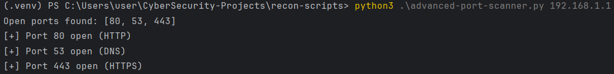

# Advanced Python Port Scanner

A high-speed, multithreaded TCP port scanner built with Python.  
Designed for penetration testers and cybersecurity learners who want to understand how port scanning works behind the scenes.

## Features

- 🔧 Customizable port range or single port scanning
- ⚙️ Multi-threaded scanning for blazing speed
- 🧠 Common service detection (based on port)
- 📡 Banner grabbing (basic)
- 📄 Output to file (TXT or JSON)
- 🌐 Hostname resolution
- 💬 Verbose mode for live progress

## Usage

python3 advanced-port-scanner.py [options] <IPv4>

## Options

| Argument        | Description                               |
| --------------- | ----------------------------------------- |
| `IPv4`          | Target IP address                         |
| `-s, --start`   | Start port (default: 1)                   |
| `-e, --end`     | End port (default: 65535)                 |
| `-t, --threads` | Number of threads (default: 500)          |
| `-p, --ports`   | Custom ports (e.g., `80,443` or `20-100`) |
| `-o, --output`  | Output file (supports `.txt`, `.json`)    |
| `-V, --verbose` | Enable live verbose output                |
| `-v, --version` | Show version info                         |

## Sample image

## Why I Built This

While preparing for the PNPT exam and practicing on TryHackMe & Hack The Box, I wanted to go beyond tools like Nmap and understand the internals of socket-based scanning. This scanner is my custom-built solution for rapid reconnaissance in internal environments.

## Disclaimer

This tool is for educational and authorized testing purposes only.
Do NOT scan systems you don’t own or have permission to test.

